# PCGNN - Procedural Content Generation with NEAT and Novelty

<p align="center">
<a href="#explanation">Generation Approach</a> &mdash; <a href="#metrics">Metrics</a> &mdash; <a href="https://arxiv.org/abs/2204.06934">Paper</a> &mdash; <a href="https://github.com/Michael-Beukman/PCGNN/blob/main/doc/poster.pdf">Poster</a> &mdash; <a href="#features">Examples</a> 
</p>

- [PCGNN - Procedural Content Generation with NEAT and Novelty](#pcgnn---procedural-content-generation-with-neat-and-novelty)
  - [About](#about)
  - [General structure](#general-structure)
  - [File Structure](#file-structure)
  - [Explanation](#explanation)
  - [Get started](#get-started)
  - [Entry Points](#entry-points)
    - [Generate Levels.](#generate-levels)
    - [Playing Levels](#playing-levels)
- [Features](#features)
  - [Works for Tilemaps](#works-for-tilemaps)
  - [Generates arbitrary sized levels without retraining](#generates-arbitrary-sized-levels-without-retraining)
    - [Mario](#mario)
    - [Maze](#maze)
- [Experiments](#experiments)
    - [Reproducing](#reproducing)
- [Metrics](#metrics)
  - [A* Diversity Metric](#a-diversity-metric)
    - [Largely Similar levels](#largely-similar-levels)
    - [Different Levels](#different-levels)
    - [All paths](#all-paths)
  - [A* Difficulty](#a-difficulty)
- [Assorted](#assorted)
  - [Island Models](#island-models)
- [Other repositories and projects used](#other-repositories-and-projects-used)
  - [Some ideas from here](#some-ideas-from-here)
  - [Issues](#issues)
- [Citation](#citation)
- [Acknowledgements](#acknowledgements)

<p align='center'>
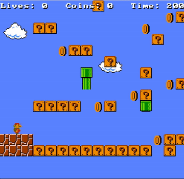
</p>


## About
This repository stores the code for two different projects. Firstly, a procedural content generation approach that combines novelty search and NeuroEvolution of Augmenting Topologies (NEAT). We also investigate two new [metrics](#metrics) for evaluating the diversity and difficulty of levels. This repository contains the code for both projects.

If you just want to get started generating or playing levels, then please look at [how to generate levels](#generate-levels) or the [examples](#works-for-tilemaps). Also feel free to look at the [paper](https://arxiv.org/abs/2204.06934) or a [poster](https://github.com/Michael-Beukman/PCGNN/blob/main/doc/poster.pdf) that summarises our approach. For information about the metrics ([paper on Arxiv](https://arxiv.org/abs/2201.10334)) and how to use them, see [here](#metrics).
## General structure
The main structure of the code is (hopefully) somewhat understandable.
First of all, to run any python file in here, use `./run.sh path/to/python/file` instead of using `python` directly, because otherwise modules are not recognised. 

Finally, the following commands should work on [wsl](https://docs.microsoft.com/en-us/windows/wsl/install) or Linux, but probably not on Windows (without some tweaking).

Most code in here can be categorised into 3 main archetypes:
1. **General / Method code.** This is how the methods were actually implemented, and these files don't do anything useful when run on their own.
2. **Runs / Experiment code.** This is a large chunk of what is in here, specifically it is code that runs the methods in some way, and generates results. Most of the results that we generate are in python pickle format.
3. **Analysis Code.** We have a pretty clear separation between experiment code (which runs the methods), and analysis code, which takes in the results and generates some usable output, like images, tables, graphs, etc.
## File Structure
Most of these are relative to `./src`
```
Method Code
├── novelty_neat     -> Our actual method
├── main
├── baselines
├── games
├── common
├── metrics

Instrumental
├── experiments
├── pipelines
├── runs
├── run.sh
├── scripts
└── slurms

Analysis
├── analysis
├── external

Data
├── levels
├── logs
├── results
├── ../results

Document
├── ../doc/report.pdf
```
## Explanation
The method roughly works as follows:
1. Evolve a neural network using NEAT (with [neat-python](https://github.com/CodeReclaimers/neat-python))
2. The fitness function for each neural network is as follows:
   1. Generate N levels per network
   2. Calculate the average solvability of these N levels
   3. Calculate how different these N levels are from each other (called intra-novelty). Calculate the average of this.
   4. Calculate how different these N levels are from the other networks' levels (normal novelty)
   5. Fitness (network) = w1 * Solvability + w2 * Intra-Novelty + w3 * Novelty.
3. Update the networks using the above calculated fitness & repeat for X generations.

After this 'training' process, take the best network and use it to generate levels in real time.

The way novelty is calculated can be found in the report, or from the original paper by Joel Lehman and Kenneth O. Stanley, [here](https://link.springer.com/chapter/10.1007/978-1-4614-1770-5_3).

We compare levels by considering a few different distance functions, like the normalised [Hamming Distance](https://en.wikipedia.org/wiki/Hamming_distance) and [Image Hashing](https://github.com/JohannesBuchner/imagehash), but others can also be used.
## Get started
To get started you would require a python environment.

To set up your python environment, do the following to create an env with the correct version.
```
conda create -n pcgnn python=3.9
```

then run this to activate it
```
conda activate pcgnn
```
And finally, install the necessary packages using pip.

```
pip install -r pcgnn_requirements.txt
```


There is also another environment that is used specifically for interacting with the [gym_pcgrl](https://github.com/amidos2006/gym-pcgrl) codebase. If that is something you want to do, then create another environment from the `env_pcgrl.yml` file.

For full functionality, you will also need java installed. The `openjdk 16.0.1 2021-04-20` version worked well.

Additionally, most of the actual experiments used [Weights & Biases](https://wandb.ai/) to log experiments and results, so you would also need to log in using your credentials. The simple entry points described below should not require it.

## Entry Points
At the moment, the easiest way to interact with the codebase would be to use the code in `src/main/`.
### Generate Levels.
To have a go at generating levels, then you can use the functions provided in `src/main/main.py`. Specifically you can call this (remember to be in the `src` directory before running these commands):
```
./run.sh main/main.py --method noveltyneat --game mario --command generate --width 114 --height 14
```

The above allows you to view some generated levels.
### Playing Levels
You can also play the (Mario) levels, or let an agent play them. After generating a level using the above, you can play it by using:

```
./run.sh main/main.py --game mario --command play-human --filename test_level.txt
```

Or you can let an A* agent play it using

```
./run.sh main/main.py --game mario --command play-agent --filename test_level.txt
```
# Features
## Works for Tilemaps
<p align='center'>


</p>


## Generates arbitrary sized levels without retraining
### Mario
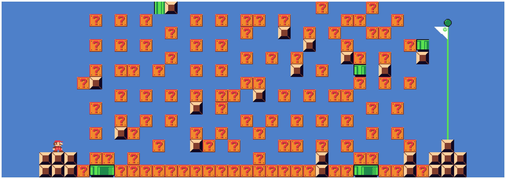
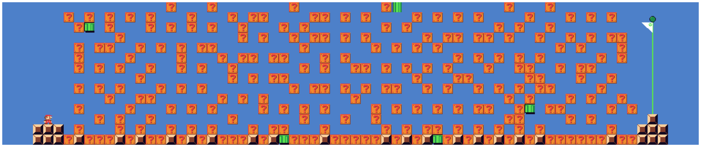
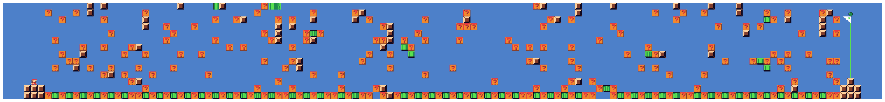
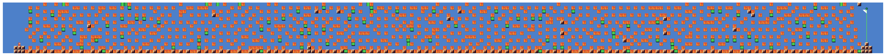
### Maze


<p align="center">
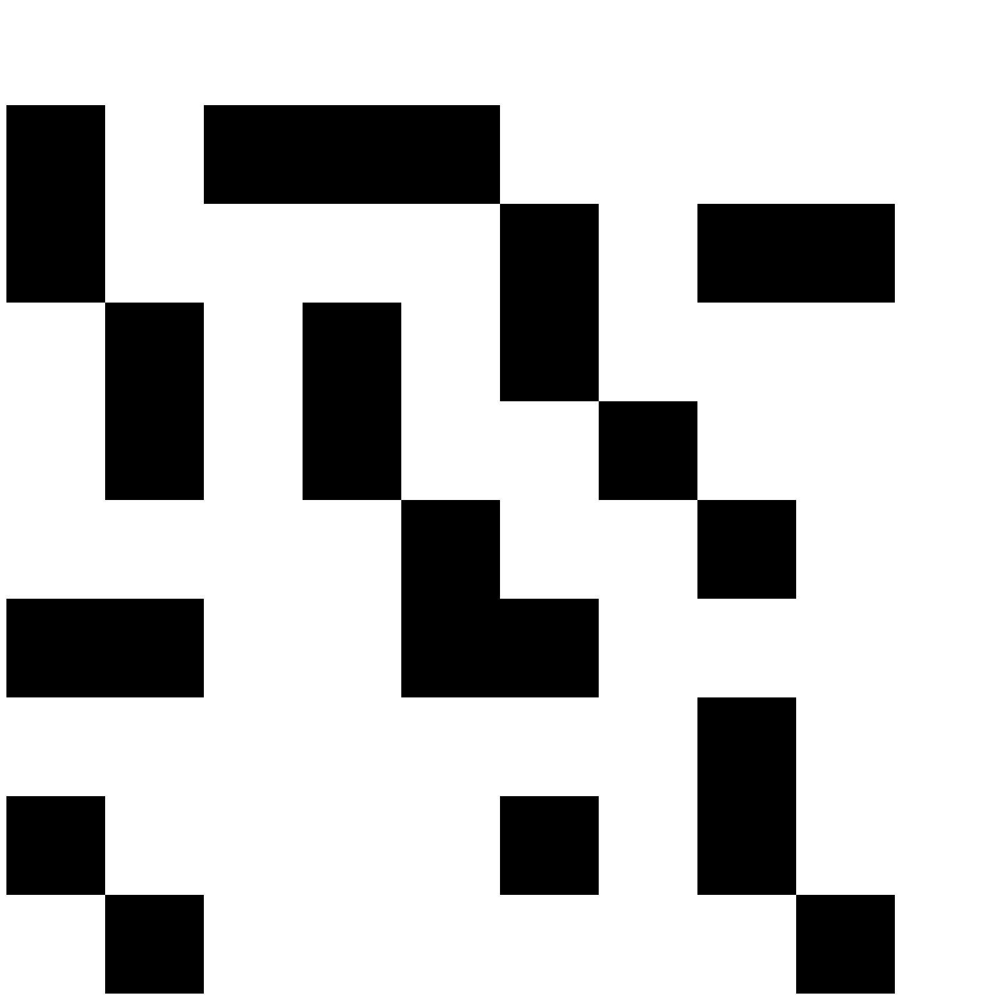
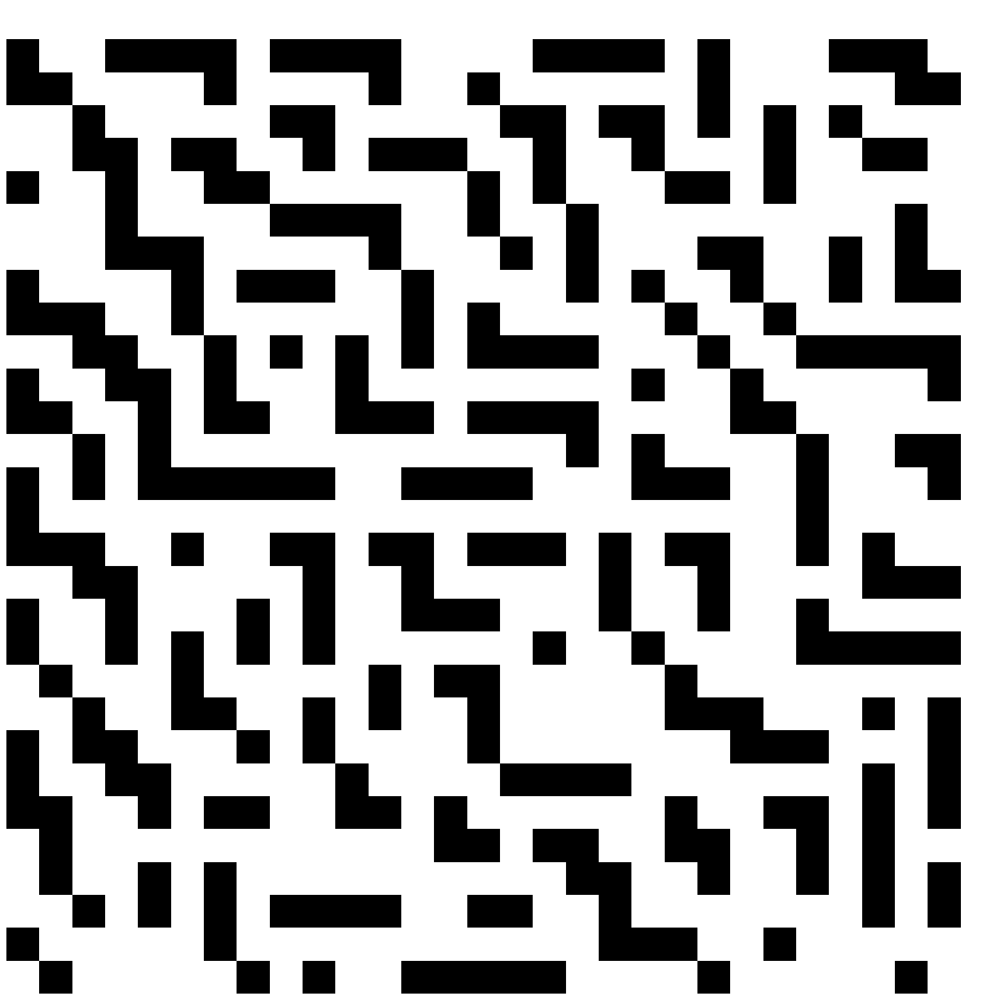<br>
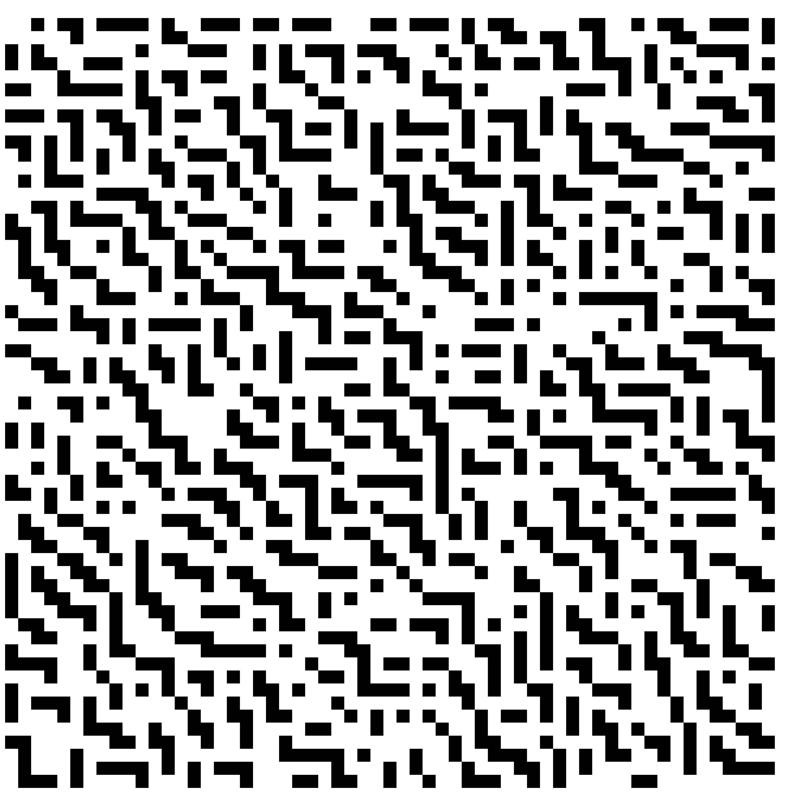
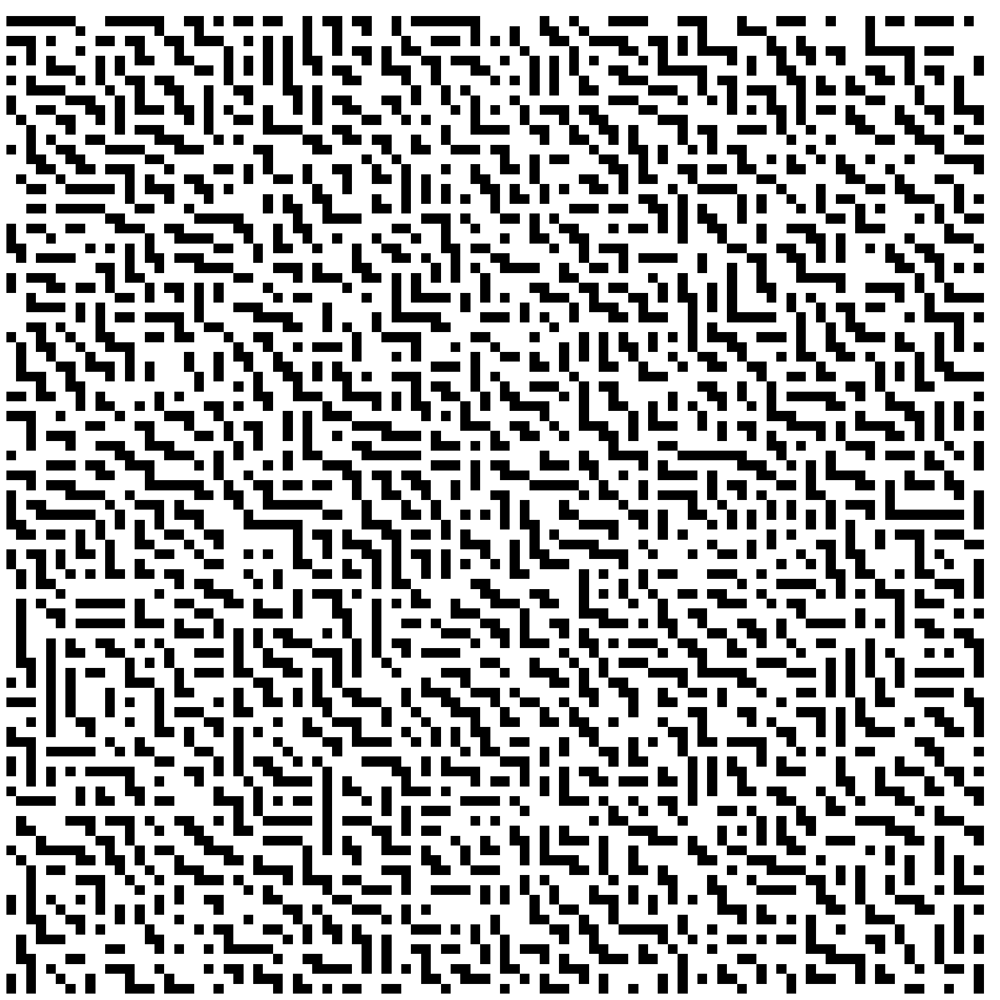<br>
</p>

# Experiments
We have many different experiments, with the following meaning:

Generalisation - Generate Larger levels
- **v206**: Mario
- **v104**: Maze NEAT
- **v107**: Maze DirectGA

Metrics
- **v202**: Mario
- **v106**: Maze

Method runs
- **v105**: Maze NEAT
- **v102**: Maze DirectGA
- **v204**: Mario NEAT
- **v201**: Mario DirectGA

Additional Experiments (largely shown in the appendix)
- **v501**: Diversity Functions test for Maze
- **v502**: Diversity Functions test for Mario
- **v551**: Fitness Plots for Maze
- **v552**: Fitness Plots for Mario
- **v581**: Random Baseline for Maze
- **v582**: Random Baseline for Mario

The PCGRL code can be found in `./src/external/gym-pcgrl`
### Reproducing
Our results that were shown and mentioned in the report are mainly found in `src/results/`.

The following describes how to reproduce our results. Note, there might be some difference in the ordering of the images (e.g. mario-level-0.png and mario-level-1.png will swap), but the set of level images generated should be exactly the same. There is one experiment (104), in which this is not the case, but the metric values are very similar, so the effect of this is minor.


The whole process contains 3 steps, and does assume a [Slurm](https://slurm.schedmd.com/documentation.html) based cluster scheduler. Please also change the logfile locations (look at running `src/pipelines/replace_all_paths.sh` **from the repository root** after changing paths in there -  this updates all paths, and decompresses some results). Our partition name was `batch`, so this also potentially needs to be updated in the Slurm scripts.

You need to run the following three scripts, in order, and before you start the next one, all the jobs from the previous one must have finished.

Note, timing results probably will differ, and for fairness, we recommend using a machine with at least 8 cores, as we do usually run multiple seeds in parallel. Do not continue on to the next step before all runs in the current one have finished.
First of all, `cd src/pipelines`
1. `./reproduce_full.sh`    -> Runs the DirectGA & NoveltyNEAT experiments.
2. `./analyse_all.sh`       -> Reruns the metric calculations on the above, and saves it to a easy to work with format
3. `./finalise_analysis.sh` -> Uses the above results to create figures and tables.

The analysis runs (steps 2 and 3.) should automatically use the latest results.
If you want to change this, then before going from one step to the next, you will need to manually update the location of the `.p` files, e.g. between step 1. and 2., you need to update 
- `src/analysis/proper_experiments/v200/for_mario_generation_1.py`, 
- `src/analysis/proper_experiments/v100/for_maze_1.py`, 
- `src/analysis/proper_experiments/v100/analyse_104.py`
- `src/analysis/proper_experiments/v200/analyse_206.py`. 

Likewise, between step 2. and 3., you need to update (only if you don't want to analyse the latest runs.)
- `src/analysis/proper_experiments/v400/analyse_all_statistical_tests.py` and 
- `src/analysis/proper_experiments/v400/analyse_all_metrics_properly.py`.


For PCGRL, the runs do take quite long, so it is suggested to use our models / results. If you really want to rerun the training, you can look at the Slurm scripts in `src/slurms/all_pcgrl/*.batch`.

For the PCGRL inference, there are two steps to do, specifically:
1. Run `infer_pcgrl.py`
2. Then run the analysis scripts again, specifically `analyse_all.sh` and `finalise_analysis.sh` (noting to change the PCGRL filepaths in `for_mario_generation_1.py` and `for_maze_1.py`)


Note: The models for turtle (both Mario and Maze) were too large for Github and are thus not included here, but wide is.

# Metrics
We also introduce 2 metrics to measure the diversity and difficulty of levels using A* agents. The code for these metrics are in `metrics/a_star/a_star_metrics.py`. 

## A* Diversity Metric
The A* diversity metric uses the trajectory of the agent on two levels to evaluate the diversity. Levels that are solved using different paths are marked as diverse, whereas levels with similar paths are marked as similar.

### Largely Similar levels
Diversity = 0.08
<p align="center">
  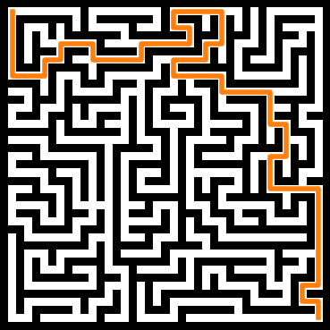
&nbsp; &nbsp; &nbsp; &nbsp;
  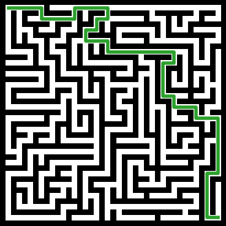
</p>

### Different Levels
Diversity = 0.27
<p align="center">
  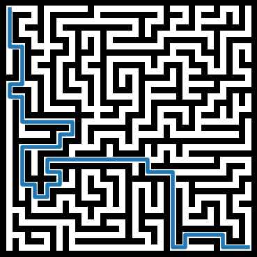
&nbsp; &nbsp; &nbsp; &nbsp;
  
</p>

### All paths

<p align="center">
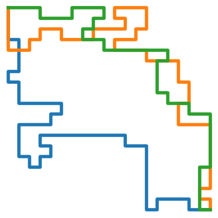
</p>
The green and orange paths are quite similar, leading to low diversity


----

## A* Difficulty
This metric measures how much of the search tree of an A* agent needs to be expanded before the agent can solve the level - more expansion indicates more exploration is required and that the level is more difficult.

<p align="center">
  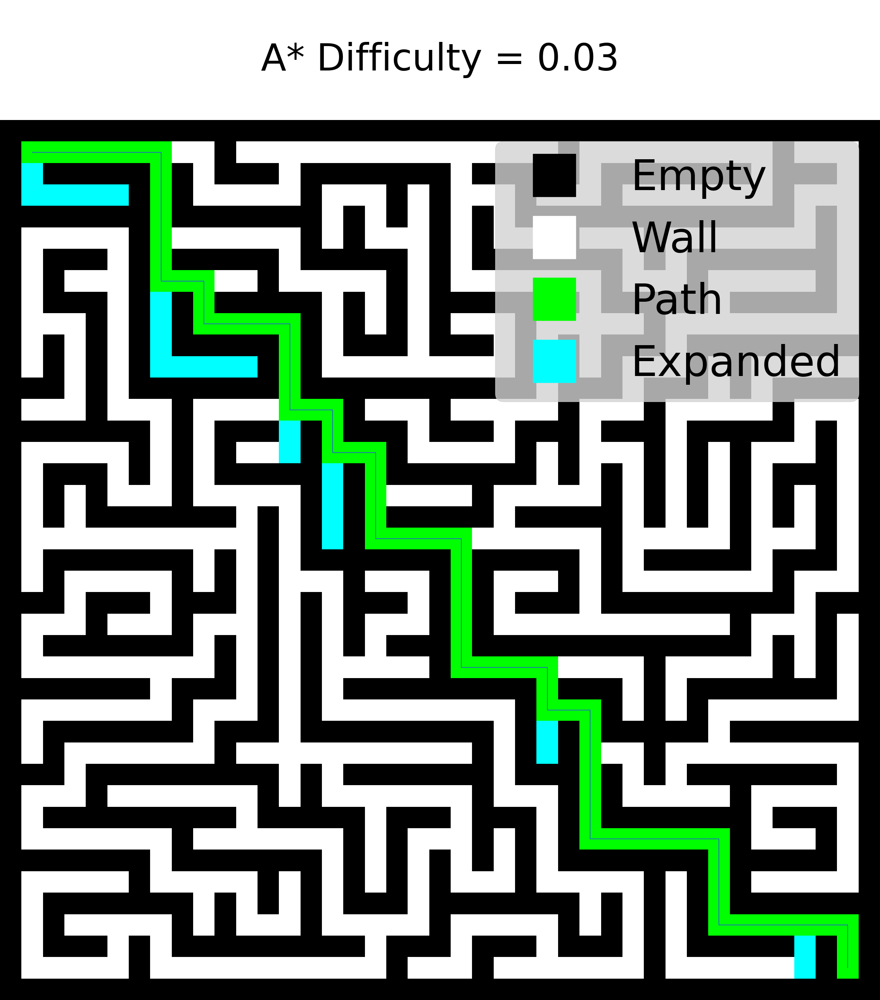
&nbsp; &nbsp; &nbsp; &nbsp;
  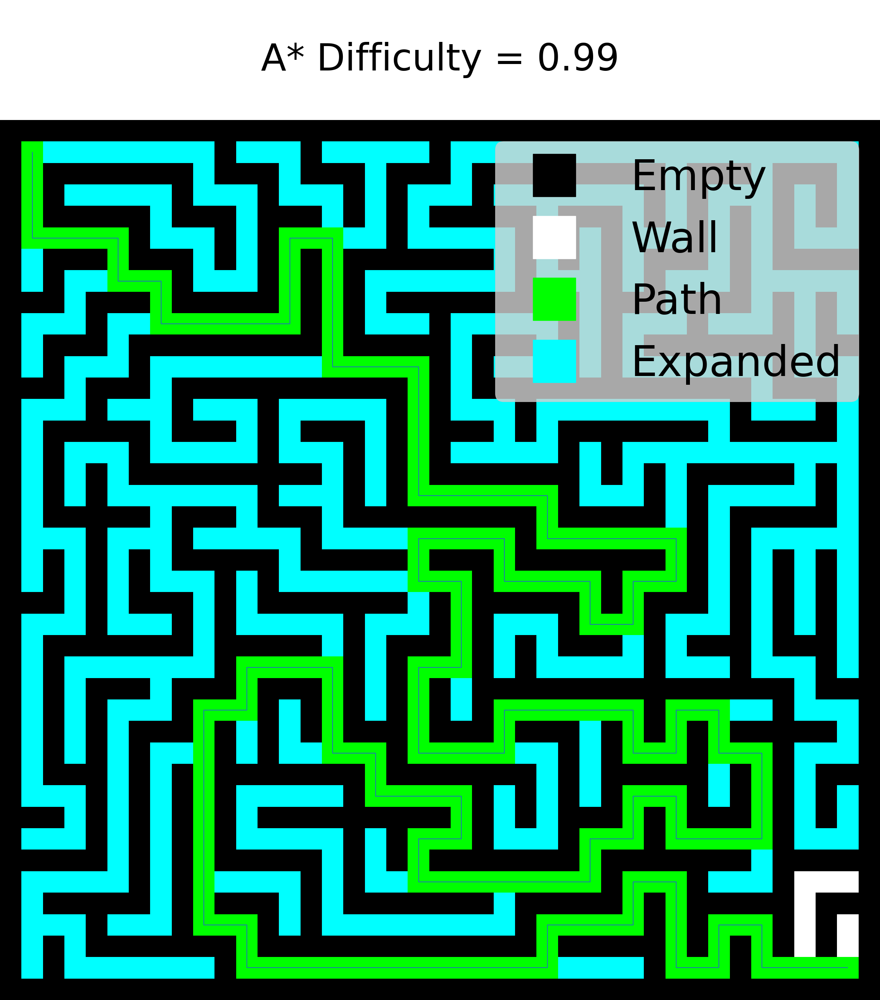
</p>

Applying the metrics code to levels is done in (among others) `src/runs/proper_experiments/v300_metrics`.


We also experimented with using RL agents to measure the above characteristics, and results looked promising, but the implementation posed some challenges. 

Feel free to look in 
- `metrics/rl/tabular/rl_agent_metric.py`
- `metrics/rl/tabular/tabular_rl_agent.py`
- `metrics/rl/tabular/rl_difficulty_metric.py` 

for this code.

# Assorted
## Island Models
There is also some code (not thoroughly tested) that uses multiple island populations and performs regular migration between them and these can be found in `novelty_neat/mario/test/island_mario.py`, `novelty_neat/maze/test/island_model.py` and `src/runs/proper_experiments/v200_mario/v203_island_neat.py`.
# Other repositories and projects used
These can be found in `src/external`. We did edit and adapt some of the code, but most of it is still original.
- [gym_pcgrl](https://github.com/amidos2006/gym-pcgrl)          -> Baseline and utility code.
- [Mario-AI-Framework](https://github.com/amidos2006/Mario-AI-Framework) -> Simulate Mario, implement our metrics.
- [PCG Evaluation](http://sokath.com/fdg2014_pcg_evaluation/) -> Compare against leniency
- [CS229Mario](http://code.google.com/p/cs229mario) -> RL agent for Mario.
- [Personal-Maze](https://github.com/mwmancuso/Personal-Maze) -> Maze generator according to difficulty.

## Some ideas from here
- https://github.com/MattChanTK/gym-maze
- https://www.samyzaf.com/ML/rl/qmaze.html


And some snippets from Stack Overflow, which I've tried to reference where they were used.
## Issues
If there are any problems or errors, then please open an [issue](https://github.com/Michael-Beukman/PCGNN/issues).
# Citation
If you find the generation method useful, consider citing this work:
```
@inproceedings{PCGNN,
  title={Procedural Content Generation using Neuroevolution and Novelty Search for Diverse Video Game Levels},
  author={Beukman, Michael and Christopher Cleghorn and James, Steven},
  booktitle={Proceedings of the Genetic and Evolutionary Computation Conference},
  year={2022},
  month={July}
}
```

The metrics were introduced here:
```
@article{a_star_metrics,
  author={Beukman, Michael and James, Steven and Christopher Cleghorn},
  title     = {Towards Objective Metrics for Procedurally Generated Video Game Levels},
  journal   = {CoRR},
  year      = {2022},
  url       = {https://arxiv.org/abs/2201.10334},
}
```
# Acknowledgements
This work is based on the research supported wholly by the National Research Foundation of South Africa (Grant UID 133358).
