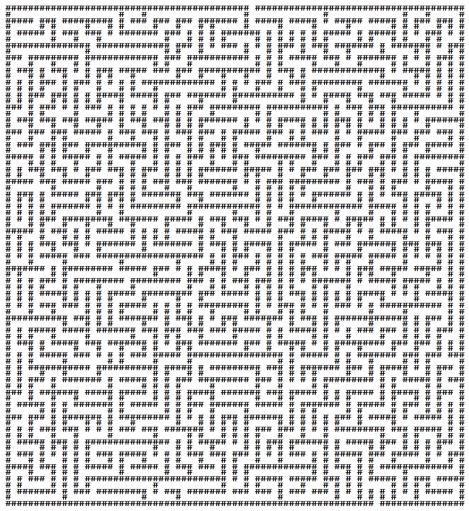
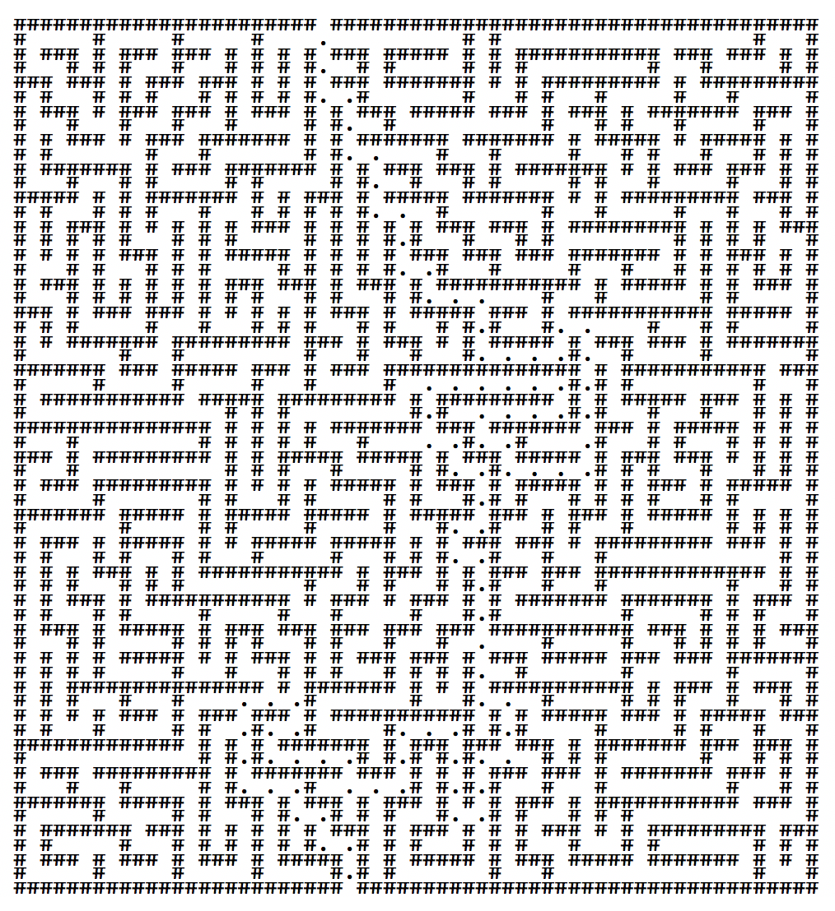

# Maze Generator
This project is dated in February 2015. It was primarily an exercise to teach myself Java.

No prior research was conducted before starting the project. The algorithm is thus naïve and likely over-complicated.

## Using the Program
The entry-point into the program is through Handler.java. Simply running the program as-is will produce a 40x40 ASCII maze at the highest difficulty.

The maze parameters may be modified by using the `builder` instance's methods. For example, creating a 30x30 maze at medium difficulty:
```java
Builder builder = new Builder();
Maze maze = builder.setSize(30,30).setDifficulty(Maze.Difficulty.MEDIUM).saveCorrectPath(true).build();
```
Note that the difficulties available are `EASY`, `MEDIUM`, `HARD` and `EXTREME`, though any integer between 1 and 10 may be used.

The only available display mechanism so far is an ASCII maze. To display the maze, simply take the maze instance and call `.getAsciiMaze()`. If you want the correct path to be displayed, simply specify the indicator as the second parameter:
```java
String print = maze.getAsciiMaze("#", ".");
System.out.print(print);
```
This will display walls as `#` and the correct path as `.`.

## Examples
The following examples use 10pt Consolas font with 6pt line height.

### 40x40, Difficulty: Extreme, No solution


### 30x30, Difficulty: Medium, Contains solution


## Algorithm
The algorithm resembles a mixture of [Recursive Backtracking](http://weblog.jamisbuck.org/2010/12/27/maze-generation-recursive-backtracking) and [Kruskal's Algorithm](http://weblog.jamisbuck.org/2011/1/3/maze-generation-kruskal-s-algorithm).

### Parameters
The main parameters for the maze are the dimensions and the difficulty. The dimensions are self-explanatory.

The difficulty (an integer from 1 to 10, where `EASY` = 1, `MEDIUM` = 5, `HARD` = 8 and `EXTREME` = 10) is used to determine both the minimum number of moves (up, down, left and right) required to complete the maze, and the maximum number of moves that any sub-path may contain. The exact formula is:
```java
double percentageTotalMain = (0.10+((difficulty/10)*0.15));
double percentageTotalSub = (0.05+((difficulty/10)*.20));
int area = sizeX*sizeY;
minMoves = (int) Math.round(area*percentageTotalMain);
maxSubPathMoves = (int) Math.round(area*percentageTotalSub);
```

Thus, a difficulty of 10 indicates that 25% of the area will be occupied by the correct path, and that any sub-path (or decoy path) may also occupy 25% of the area.

The theory behind the difficulty calculation is that as the correct path grows longer, the more likely the solver will get stuck in a dead-end. Additionally, as the sub-paths (or decoy paths) grow longer, the solver will have to backtrack much more to discover the correct path.

### Process
The algorithm begins by creating a 2D array (equal to the size of the maze) of random floating point numbers, as well as a random starting coordinate along the top border. For simplicity and repeatability, the numbers should be generated in the same order by a pseudo-random number generator. This way, the seed can be saved and used later to create the same maze.

Then, the initial—or correct—path is to be generated. Due to the nature of this algorithm, this path is the *only* path the solver may take to solve the maze. The initial path starts on the top border, but may end at any of the four borders. The process is as follows:
1. Begin at the starting coordinate
2. Find the empty adjacent cell with the highest value (go to step 5 if no empty cell exists)
3. Add this cell to the path
4. Test:
   1. Is the cell adjacent to a border? If no, go to step 2
   2. Is the path length equal or greater to minMoves, as determined by the difficulty in Parameters above? **If yes, the path is complete**
   3. If the path is too short, continue:
5. Backtrack one cell along the path and record it as backtracked
6. Go to step 2

Once the initial path is defined, the process then continues by defining sub-paths, or decoy paths. These paths are meant to trap the solver deep within the maze with no options—other than backtracking.

Each sub-path is associated with a parent path. The first set of sub-paths (1st-level) will build off of the initial path. Once every cell of the initial path is surrounded by a sub-path, the algorithm then builds 2nd-level sub-paths off of the 1st-level sub-paths, until either the maze is filled or until every cell of the 2nd-level sub-paths is surrounded by a sub-path. This process continues deeper until every cell in the maze is part of a path. Note that no backtracking happens for sub-paths—once a path hits a dead-end, it is complete.

In detail:
1. The `sub-path level` is 1, and `path number` is 1
2. Begin at the starting coordinate of the initial (parent) path
3. Find the empty adjacent cell with the highest value (go to step 6 if no empty cell exists)
4. Add this cell to the sub-path
5. Test:
   1. Is the path length equal to maxSubPathMoves, as determined by the difficulty in Parameters above? If yes, continue to step 7
   2. Is the entire maze complete? **If yes, the process and the maze is complete**
6. Go to the next cell along the parent path (go to step 9 is parent path is exhausted)
7. Go to step 3
8. Test:
   1. Does an unvisited sub-path of `sub-path level - 1` exist? If not, go to step 11
      * If `sub-path level` is 1, `sub-path level - 1` will only have the initial path, which is visited
9. Switch to the next unvisited path of `sub-path level - 1`, treat as parent path
10. Go to step 2
11. Increment `sub-path level`
12. Go to step 9

## Improvements
The current implementation of this maze generator is direction biased. This means that solving the maze from start-to-finish is harder than from finish-to-start. To solve this issue, the sub-paths may be created at random points along their parent paths, as opposed to in order. This way, long decoy paths may appear toward the center of the maze—effectively removing the direction bias.

The code for this project is also very lengthy, uses a lot of memory, and may run slow on old hardware. The code can be significantly improved by finding alternative solutions for lengthy methods, such as:
* `pathGridFull()`, which is called for every new sub-path
* `pathExhausted()`, which loops over the entire path multiple times per sub-path
